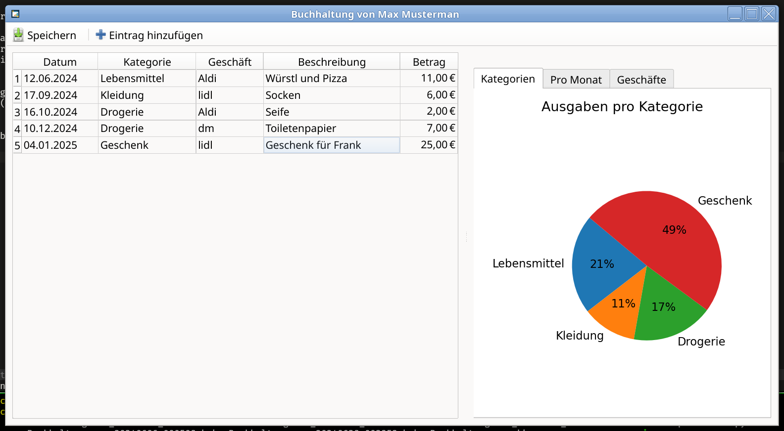
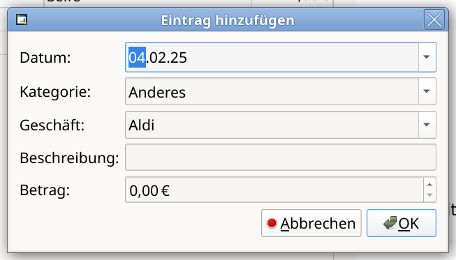
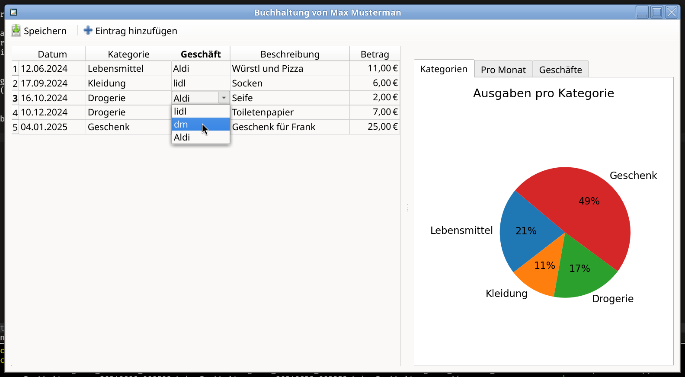
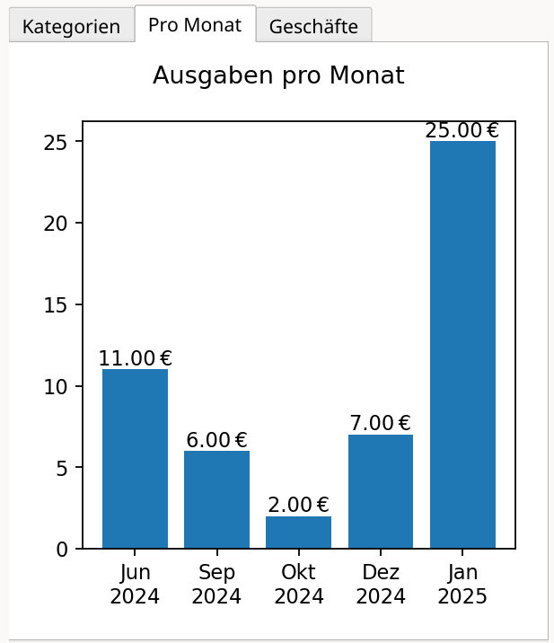
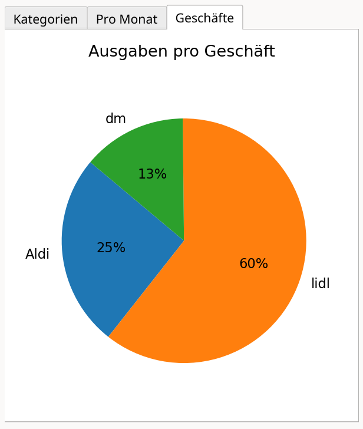

microaccounting - minimal bookkeeping software
===============================================

Microaccounting is a bookkeeping software for people with need for a extremely
simple and minimalistic software. It was written for a person with disabilities.

Features:
- Add expenses with a category, shop and description
- Live updated graphics
- View and edit expenses in a table
- Drop down menus for categories and shops
- Change font sizes by pressing	Ctrl+ and Ctrl-

Limitations:
- No double	entry bookkeeping (On purpose)
- Only expanses, no	incomes (On purpose)
- No undo
- No export
- So far German only – will be translated to English if there is interest

# Screenshots

